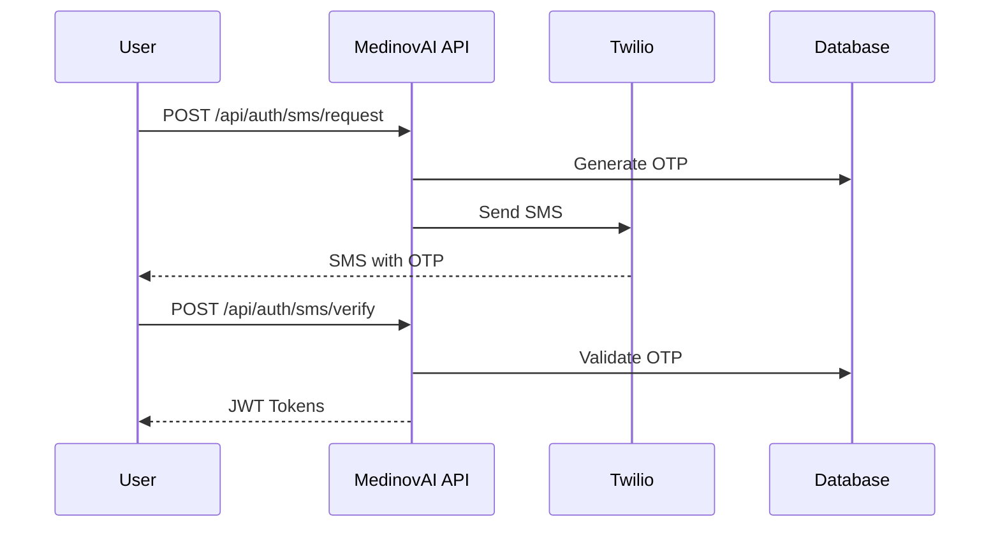

# Authentication API Documentation

The MedinovAI Chatbot Authentication API provides secure, HIPAA-compliant user authentication through multiple methods including SMS OTP verification and OAuth2 integration.

## Overview

The authentication system supports dual authentication methods:
- **SMS Verification**: Phone number + OTP via Twilio
- **OAuth2 Login**: Integration with myOnsite patient portal or third-party providers
- **JWT Management**: Secure session management with refresh tokens

## Base URL

```
Production: https://api.myonsitehealthcare.com
Staging: https://staging-api.myonsitehealthcare.com
Development: http://localhost:8000
```

## Authentication Flow



---

## Endpoints

### 🔐 SMS Authentication

#### Request SMS OTP

Send an OTP code to the user's phone number.

```http
POST /api/auth/sms/request
Content-Type: application/json

{
  "phone_number": "+1234567890",
  "language": "en"
}
```

**Request Parameters:**
- `phone_number` (string, required): E.164 format phone number
- `language` (string, optional): Language code for SMS (en, es, zh, hi)

**Response:**
```json
{
  "success": true,
  "message": "OTP sent successfully",
  "request_id": "req_123456789",
  "expires_in": 300,
  "retry_after": 60
}
```

**Error Responses:**
```json
{
  "error": "invalid_phone_number",
  "message": "Phone number format is invalid",
  "code": 400
}
```

#### Verify SMS OTP

Verify the OTP code and receive authentication tokens.

```http
POST /api/auth/sms/verify
Content-Type: application/json

{
  "phone_number": "+1234567890",
  "otp_code": "123456",
  "request_id": "req_123456789"
}
```

**Request Parameters:**
- `phone_number` (string, required): Same phone number from request
- `otp_code` (string, required): 6-digit OTP code
- `request_id` (string, required): Request ID from OTP request

**Response:**
```json
{
  "success": true,
  "user": {
    "id": "user_123",
    "phone_number": "+1234567890",
    "verified": true,
    "created_at": "2024-01-15T10:30:00Z"
  },
  "tokens": {
    "access_token": "eyJhbGciOiJIUzI1NiIsInR5cCI6IkpXVCJ9...",
    "refresh_token": "eyJhbGciOiJIUzI1NiIsInR5cCI6IkpXVCJ9...",
    "token_type": "Bearer",
    "expires_in": 3600
  }
}
```

#### Resend OTP

Resend OTP code to the same phone number.

```http
POST /api/auth/sms/resend
Content-Type: application/json

{
  "request_id": "req_123456789"
}
```

---

### 🌐 OAuth2 Authentication

#### OAuth2 Login Initiation

Start OAuth2 authentication flow.

```http
GET /api/auth/oauth2/login?provider=google&redirect_uri=https://app.example.com/callback
```

**Query Parameters:**
- `provider` (string, required): OAuth2 provider (google, microsoft, myonsite)
- `redirect_uri` (string, required): Callback URL after authentication
- `state` (string, optional): Anti-CSRF state parameter

**Response:**
```json
{
  "auth_url": "https://accounts.google.com/oauth/authorize?client_id=...",
  "state": "random_state_string"
}
```

#### OAuth2 Callback

Handle OAuth2 callback and exchange code for tokens.

```http
POST /api/auth/oauth2/callback
Content-Type: application/json

{
  "provider": "google",
  "code": "authorization_code",
  "state": "random_state_string",
  "redirect_uri": "https://app.example.com/callback"
}
```

**Response:**
```json
{
  "success": true,
  "user": {
    "id": "user_456",
    "email": "patient@example.com",
    "name": "John Doe",
    "provider": "google",
    "verified": true
  },
  "tokens": {
    "access_token": "eyJhbGciOiJIUzI1NiIsInR5cCI6IkpXVCJ9...",
    "refresh_token": "eyJhbGciOiJIUzI1NiIsInR5cCI6IkpXVCJ9...",
    "token_type": "Bearer",
    "expires_in": 3600
  }
}
```

---

### 🔄 Token Management

#### Refresh Access Token

Get a new access token using refresh token.

```http
POST /api/auth/token/refresh
Content-Type: application/json
Authorization: Bearer <refresh_token>

{
  "refresh_token": "eyJhbGciOiJIUzI1NiIsInR5cCI6IkpXVCJ9..."
}
```

**Response:**
```json
{
  "access_token": "eyJhbGciOiJIUzI1NiIsInR5cCI6IkpXVCJ9...",
  "token_type": "Bearer",
  "expires_in": 3600
}
```

#### Revoke Token

Revoke access or refresh token.

```http
POST /api/auth/token/revoke
Content-Type: application/json
Authorization: Bearer <access_token>

{
  "token": "eyJhbGciOiJIUzI1NiIsInR5cCI6IkpXVCJ9...",
  "token_type": "access_token"
}
```

**Response:**
```json
{
  "success": true,
  "message": "Token revoked successfully"
}
```

#### Validate Token

Validate and get token information.

```http
GET /api/auth/token/validate
Authorization: Bearer <access_token>
```

**Response:**
```json
{
  "valid": true,
  "user_id": "user_123",
  "expires_at": "2024-01-15T11:30:00Z",
  "scopes": ["read", "write"],
  "token_type": "access_token"
}
```

---

### 👤 User Profile

#### Get Current User

Get authenticated user information.

```http
GET /api/auth/user/me
Authorization: Bearer <access_token>
```

**Response:**
```json
{
  "id": "user_123",
  "phone_number": "+1234567890",
  "email": "patient@example.com",
  "name": "John Doe",
  "verified": true,
  "auth_method": "sms",
  "language": "en",
  "timezone": "America/New_York",
  "created_at": "2024-01-15T10:30:00Z",
  "last_login": "2024-01-15T10:30:00Z"
}
```

#### Update User Profile

Update user profile information.

```http
PUT /api/auth/user/me
Content-Type: application/json
Authorization: Bearer <access_token>

{
  "name": "John Smith",
  "language": "es",
  "timezone": "America/Los_Angeles"
}
```

#### Logout

Logout user and revoke all tokens.

```http
POST /api/auth/logout
Authorization: Bearer <access_token>
```

**Response:**
```json
{
  "success": true,
  "message": "Logged out successfully"
}
```

---

## Authentication Headers

All authenticated requests must include the Authorization header:

```http
Authorization: Bearer <access_token>
```

## Error Codes

| Code | Error | Description |
|------|-------|-------------|
| 400 | `invalid_request` | Missing or invalid request parameters |
| 401 | `unauthorized` | Invalid or expired token |
| 403 | `forbidden` | Insufficient permissions |
| 404 | `user_not_found` | User does not exist |
| 409 | `phone_already_verified` | Phone number already verified |
| 422 | `invalid_otp` | OTP code is incorrect or expired |
| 429 | `rate_limit_exceeded` | Too many requests |
| 500 | `internal_error` | Internal server error |

## Rate Limiting

| Endpoint | Limit | Window |
|----------|-------|--------|
| SMS Request | 5 requests | 1 hour |
| SMS Verify | 10 attempts | 5 minutes |
| OAuth2 Login | 50 requests | 1 hour |
| Token Refresh | 100 requests | 1 hour |

## Security Considerations

### SMS Security
- OTP codes expire after 5 minutes
- Maximum 3 retry attempts before phone number lockout
- Rate limiting prevents abuse
- Phone numbers are validated and sanitized

### JWT Security
- Access tokens expire after 1 hour
- Refresh tokens expire after 7 days
- Tokens are signed with RS256 algorithm
- Automatic token rotation on refresh

### OAuth2 Security
- State parameter prevents CSRF attacks
- PKCE (Proof Key for Code Exchange) for public clients
- Secure redirect URI validation
- Scope-based access control

## HIPAA Compliance

### PHI Protection
- Phone numbers are encrypted at rest
- All authentication events are logged
- No PHI is included in JWT tokens
- Secure token storage requirements

### Audit Logging
All authentication events are logged with:
- Timestamp and user ID
- Authentication method used
- IP address and user agent
- Success/failure status
- Request ID for tracing

## Testing

### Development Environment
```bash
# Test SMS authentication
curl -X POST http://localhost:8000/api/auth/sms/request \
  -H "Content-Type: application/json" \
  -d '{"phone_number": "+1234567890"}'

# Verify with test OTP (development only)
curl -X POST http://localhost:8000/api/auth/sms/verify \
  -H "Content-Type: application/json" \
  -d '{"phone_number": "+1234567890", "otp_code": "123456", "request_id": "req_123"}'
```

### Test Phone Numbers (Development)
- `+15551234567` - Always succeeds
- `+15551234568` - Always fails with invalid_otp
- `+15551234569` - Simulates network error

## SDKs and Examples

### JavaScript/TypeScript
```typescript
import { MedinovAIAuth } from '@medinovai/auth-sdk';

const auth = new MedinovAIAuth({
  baseURL: 'https://api.myonsitehealthcare.com',
  clientId: 'your-client-id'
});

// SMS Authentication
const result = await auth.sms.request('+1234567890');
const tokens = await auth.sms.verify('+1234567890', '123456', result.requestId);

// OAuth2 Authentication
const authUrl = await auth.oauth2.getAuthUrl('google', 'https://app.com/callback');
const tokens = await auth.oauth2.handleCallback(code, state);
```

### Python
```python
from medinovai_auth import MedinovAIAuth

auth = MedinovAIAuth(
    base_url='https://api.myonsitehealthcare.com',
    client_id='your-client-id'
)

# SMS Authentication
result = auth.sms.request('+1234567890')
tokens = auth.sms.verify('+1234567890', '123456', result.request_id)

# OAuth2 Authentication
auth_url = auth.oauth2.get_auth_url('google', 'https://app.com/callback')
tokens = auth.oauth2.handle_callback(code, state)
```

## Support

For authentication-related issues:
- **Documentation**: [Authentication Troubleshooting](../troubleshooting/authentication.md)
- **Support**: support@myonsitehealthcare.com
- **Emergency**: +1-XXX-XXX-XXXX (24/7 for security issues) 