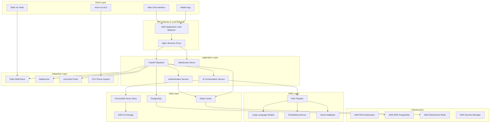
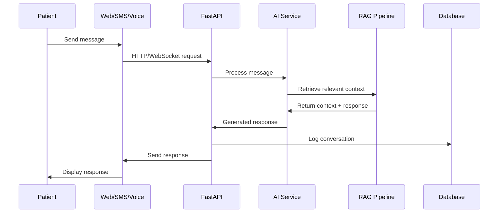
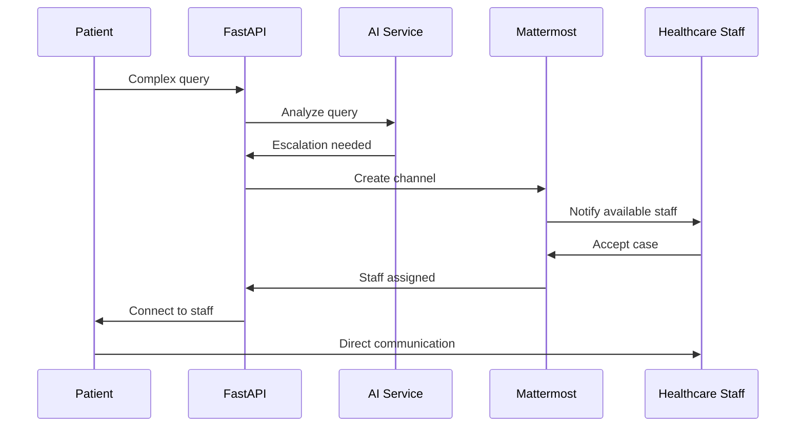
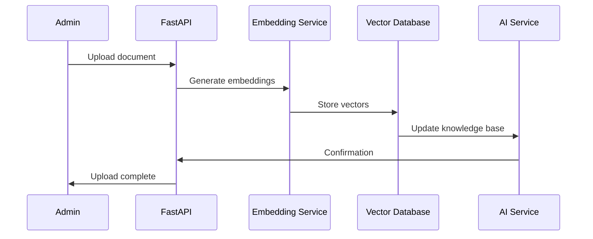

# MedinovAI Chatbot - System Architecture Overview

This document provides a comprehensive overview of the MedinovAI Chatbot system architecture, including its components, data flow, and technology stack.

## Executive Summary

MedinovAI Chatbot is a HIPAA-compliant, cloud-native healthcare AI assistant built on a microservices architecture. The system provides multi-channel patient interaction through web chat, SMS, and voice, with seamless escalation to healthcare staff via Mattermost integration.

## High-Level Architecture

## Core Components

### 1. **Client Interfaces**

#### Web Chat Interface
- **Technology**: React/Next.js with TypeScript
- **Features**: Real-time messaging, file uploads, multi-language support
- **Security**: HTTPS, CSP headers, XSS protection
- **Accessibility**: WCAG 2.1 AA compliant

#### SMS Integration
- **Provider**: Twilio Programmable SMS
- **Features**: Bidirectional messaging, OTP authentication, delivery tracking
- **Languages**: English, Spanish, Chinese, Hindi
- **Compliance**: HIPAA-compliant message handling

#### Voice Integration
- **Provider**: 3CX Phone System + Twilio Voice
- **Features**: IVR, speech-to-text, text-to-speech
- **Capabilities**: Multi-language voice recognition and synthesis

#### Mobile Application
- **Platform**: React Native (iOS/Android)
- **Features**: Push notifications, offline support, biometric authentication
- **Integration**: Same API backend as web interface

### 2. **API Gateway & Security Layer**

#### AWS Application Load Balancer
- **Features**: SSL termination, health checks, auto-scaling
- **Security**: WAF integration, DDoS protection
- **Availability**: Multi-AZ deployment

#### Nginx Reverse Proxy
- **Purpose**: Request routing, rate limiting, caching
- **Security**: Security headers, request validation
- **Performance**: Gzip compression, static file serving

### 3. **Application Services**

#### FastAPI Backend
- **Language**: Python 3.11+
- **Framework**: FastAPI with async/await
- **Features**: 
  - RESTful APIs with OpenAPI documentation
  - WebSocket support for real-time chat
  - Background task processing with Celery
  - Comprehensive error handling and logging

#### Authentication Service
- **Methods**: SMS OTP, OAuth2 (Google, Microsoft, myOnsite)
- **Security**: JWT tokens with RS256 signing
- **Features**: Multi-factor authentication, session management
- **Compliance**: HIPAA-compliant user data handling

#### AI Orchestration Service
- **Purpose**: Coordinate AI model interactions
- **Features**: 
  - Request routing to appropriate models
  - Response aggregation and processing
  - Fallback handling for model failures
  - Performance monitoring and optimization

### 4. **AI/ML Stack**

#### RAG (Retrieval-Augmented Generation) Pipeline
- **Purpose**: Ground AI responses in healthcare knowledge base
- **Components**:
  - Document ingestion and preprocessing
  - Embedding generation and storage
  - Semantic search and retrieval
  - Context augmentation for LLM prompts

#### Large Language Models
- **Primary**: OpenAI GPT-4 Turbo
- **Backup**: Anthropic Claude 3, Google Gemini Pro
- **Specialized**: Medical-specific models for clinical terminology
- **Features**: Multi-language support, healthcare-specific fine-tuning

#### Embedding Service
- **Models**: OpenAI text-embedding-ada-002, SentenceTransformers
- **Purpose**: Convert text to vector representations
- **Optimization**: Cached embeddings, batch processing

#### Vector Database
- **Primary**: ChromaDB for vector storage and similarity search
- **Backup**: Pinecone for scalability
- **Features**: Hybrid search (semantic + keyword), metadata filtering

### 5. **Integration Services**

#### Twilio Integration
- **SMS**: Programmable SMS API for text messaging
- **Voice**: Programmable Voice API for phone interactions
- **Features**: Webhook handling, delivery status tracking, phone number management

#### Mattermost Integration
- **Purpose**: Healthcare staff collaboration and escalation
- **Features**: 
  - Automated channel creation for patient cases
  - Presence detection for staff availability
  - Bot integration for automated notifications
  - File sharing for patient documents

#### myOnsite Portal Integration
- **Purpose**: EHR data access and patient portal integration
- **Features**: Patient data retrieval, appointment scheduling, lab results
- **Security**: OAuth2 integration, encrypted data exchange

#### 3CX Phone System
- **Purpose**: VOIP integration for voice calls
- **Features**: Call routing, recording, analytics
- **Integration**: RESTful API and webhook support

### 6. **Data Storage**

#### PostgreSQL Database
- **Purpose**: Primary application data storage
- **Features**: 
  - ACID compliance for data integrity
  - Row-level security for multi-tenancy
  - Encryption at rest and in transit
  - Automated backups with point-in-time recovery

#### Redis Cache
- **Purpose**: Session storage, caching, real-time data
- **Features**: 
  - In-memory performance
  - Pub/Sub for real-time notifications
  - Cluster mode for high availability
  - TTL-based expiration

#### ChromaDB Vector Store
- **Purpose**: Embedding storage and similarity search
- **Features**: 
  - Efficient vector operations
  - Metadata filtering
  - Persistence to S3
  - Horizontal scaling

#### AWS S3 Storage
- **Purpose**: File storage, backups, static assets
- **Features**: 
  - Versioning and lifecycle policies
  - Server-side encryption
  - Cross-region replication
  - CDN integration via CloudFront

## Technology Stack

### Backend Technologies
- **Language**: Python 3.11+
- **Framework**: FastAPI with Pydantic validation
- **ORM**: SQLAlchemy with Alembic migrations
- **Task Queue**: Celery with Redis broker
- **Testing**: pytest, pytest-asyncio, httpx

### Frontend Technologies
- **Framework**: Next.js 14 with React 18
- **Language**: TypeScript
- **UI Library**: Tailwind CSS with Headless UI
- **State Management**: Zustand
- **Testing**: Jest, React Testing Library, Playwright

### AI/ML Technologies
- **LLM APIs**: OpenAI GPT-4, Anthropic Claude, Google Gemini
- **Embeddings**: OpenAI text-embedding-ada-002
- **Vector Database**: ChromaDB, Pinecone
- **ML Framework**: LangChain for orchestration

### Infrastructure Technologies
- **Cloud Provider**: Amazon Web Services (AWS)
- **Container Platform**: Kubernetes on AWS EKS
- **Container Runtime**: Docker with multi-stage builds
- **Service Mesh**: Istio for traffic management
- **Monitoring**: Prometheus, Grafana, Jaeger

### Development & Operations
- **Version Control**: Git with GitHub
- **CI/CD**: GitHub Actions
- **Infrastructure as Code**: Terraform
- **Configuration Management**: Helm charts
- **Security Scanning**: Snyk, SAST, DAST

## Data Flow Architecture

### 1. **Patient Interaction Flow**

### 2. **Escalation Flow**

### 3. **Knowledge Base Update Flow**

## Security Architecture

### 1. **Defense in Depth**

- **Network Security**: VPC, security groups, NACLs
- **Application Security**: Input validation, output encoding, CSRF protection
- **Data Security**: Encryption at rest and in transit, key management
- **Identity Security**: Multi-factor authentication, role-based access control
- **Infrastructure Security**: Container scanning, vulnerability management

### 2. **HIPAA Compliance Layers**

- **Administrative Safeguards**: Access control, audit procedures, training
- **Physical Safeguards**: Data center security, workstation security
- **Technical Safeguards**: Encryption, access controls, audit logs

### 3. **Data Classification**

- **PHI (Protected Health Information)**: Highest security, encrypted, audited
- **PII (Personally Identifiable Information)**: High security, encrypted
- **Business Data**: Standard security controls
- **Public Data**: Basic security controls

## Scalability & Performance

### 1. **Horizontal Scaling**

- **Application Tier**: Kubernetes auto-scaling based on CPU/memory
- **Database Tier**: Read replicas, connection pooling
- **Cache Tier**: Redis clustering with sharding
- **AI Tier**: Model load balancing, batch processing

### 2. **Performance Optimization**

- **Caching Strategy**: Multi-layer caching (CDN, Redis, application)
- **Database Optimization**: Query optimization, indexing, partitioning
- **AI Optimization**: Model caching, embedding precomputation
- **Network Optimization**: CDN, compression, connection keep-alive

### 3. **Capacity Planning**

- **Current Baseline**: 1,000 concurrent users, 10,000 messages/hour
- **Growth Projection**: 10x growth over 2 years
- **Resource Allocation**: Auto-scaling triggers at 70% utilization
- **Cost Optimization**: Reserved instances, spot instances for batch jobs

## Monitoring & Observability

### 1. **Application Monitoring**

- **Metrics**: Response time, throughput, error rates
- **Logging**: Structured logging with correlation IDs
- **Tracing**: Distributed tracing with Jaeger
- **Alerting**: PagerDuty integration for critical issues

### 2. **Business Monitoring**

- **User Analytics**: Conversation completion rates, satisfaction scores
- **AI Performance**: Response quality, escalation rates
- **System Health**: Uptime, availability, performance trends
- **Compliance**: Audit log completeness, access patterns

### 3. **Security Monitoring**

- **SIEM Integration**: AWS CloudTrail, VPC Flow Logs
- **Threat Detection**: Unusual access patterns, failed authentications
- **Vulnerability Scanning**: Container and infrastructure scanning
- **Incident Response**: Automated alerting and response procedures

## Disaster Recovery & Business Continuity

### 1. **Backup Strategy**

- **Database Backups**: Automated daily backups with 30-day retention
- **File Backups**: S3 cross-region replication
- **Configuration Backups**: Infrastructure as Code in version control
- **Recovery Testing**: Monthly disaster recovery drills

### 2. **High Availability**

- **Multi-AZ Deployment**: Application and database across multiple AZs
- **Load Balancing**: Traffic distribution across healthy instances
- **Failover**: Automated failover for database and critical services
- **Circuit Breakers**: Graceful degradation for external dependencies

### 3. **Business Continuity**

- **RTO Target**: 4 hours for full service restoration
- **RPO Target**: 15 minutes maximum data loss
- **Critical Functions**: Patient chat, emergency escalation, staff notifications
- **Communication Plan**: Stakeholder notification procedures

## Future Architecture Considerations

### 1. **Short-term Enhancements (6 months)**

- **Edge Computing**: CloudFront with Lambda@Edge for global performance
- **AI Model Optimization**: Model quantization and caching
- **Advanced Analytics**: Real-time conversation analytics
- **Mobile App**: Native iOS and Android applications

### 2. **Medium-term Evolution (12-18 months)**

- **Multi-cloud Strategy**: Azure or GCP integration for redundancy
- **Advanced AI**: Custom healthcare models, specialized fine-tuning
- **Integration Expansion**: Additional EHR systems, telehealth platforms
- **Compliance Expansion**: SOC 2, ISO 27001 certification

### 3. **Long-term Vision (2-3 years)**

- **AI Agents**: Autonomous AI agents for complex healthcare workflows
- **Predictive Analytics**: Predictive health insights and recommendations
- **Blockchain Integration**: Secure health data sharing and consent management
- **Global Deployment**: Multi-region deployment for international expansion

## Documentation References

- [Component Design](components.md) - Detailed component specifications
- [Data Flow](data-flow.md) - Comprehensive data flow documentation
- [Security Architecture](security.md) - Security design and controls
- [Infrastructure Architecture](infrastructure.md) - AWS cloud architecture details
- [Performance Guidelines](../deployment/performance.md) - Performance optimization guide
- [Monitoring Setup](../deployment/monitoring.md) - Monitoring and alerting configuration 