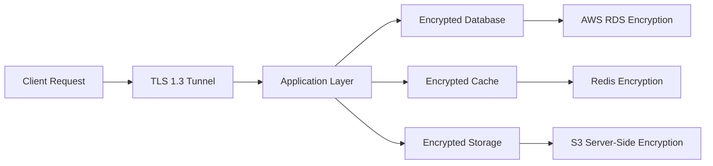
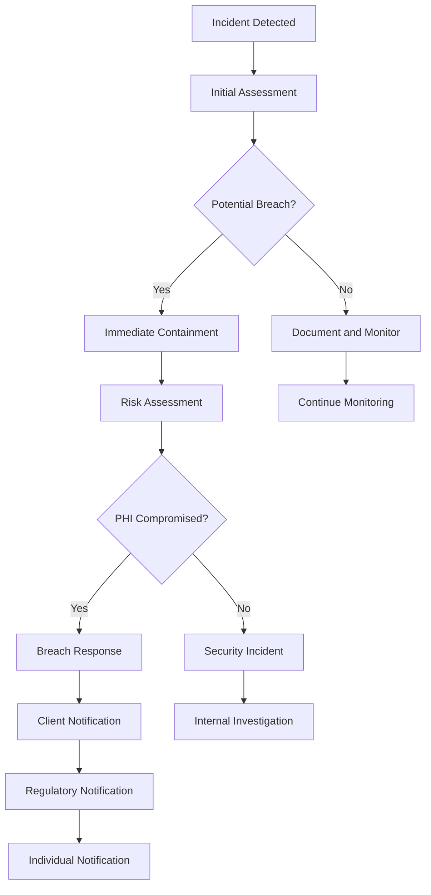

# HIPAA Compliance Overview - MedinovAI Chatbot

This document provides a comprehensive overview of how MedinovAI Chatbot achieves and maintains HIPAA (Health Insurance Portability and Accountability Act) compliance for protecting patient health information.

## Executive Summary

MedinovAI Chatbot is designed from the ground up to be HIPAA-compliant, implementing all required administrative, physical, and technical safeguards to protect Protected Health Information (PHI). Our comprehensive compliance program ensures patient data privacy, security, and regulatory adherence.

## HIPAA Compliance Framework

### What is HIPAA?

The Health Insurance Portability and Accountability Act (HIPAA) is a federal law that establishes national standards for protecting patient health information. It applies to:

- **Covered Entities**: Healthcare providers, health plans, healthcare clearinghouses
- **Business Associates**: Third-party vendors that handle PHI on behalf of covered entities
- **Subcontractors**: Vendors working for business associates

MedinovAI operates as a **Business Associate** under HIPAA, providing AI-powered chat services to healthcare organizations.

### HIPAA Rules Overview

#### 1. **Privacy Rule**
- Establishes standards for protecting PHI
- Defines permitted uses and disclosures
- Grants patients rights over their health information

#### 2. **Security Rule**
- Requires technical, administrative, and physical safeguards
- Mandates risk assessments and security measures
- Establishes audit and monitoring requirements

#### 3. **Breach Notification Rule**
- Requires notification of PHI breaches
- Defines breach assessment procedures
- Establishes reporting timelines

#### 4. **Omnibus Rule**
- Extends HIPAA to business associates
- Strengthens patient rights and penalties
- Enhances breach notification requirements

## Administrative Safeguards

### 1. **Security Officer and Workforce Training**

#### Designated Security Officer
- **Role**: Chief Security Officer (CSO)
- **Responsibilities**: HIPAA compliance oversight, policy development, incident response
- **Contact**: security@myonsitehealthcare.com

#### Workforce Training Program
- **Initial Training**: All employees complete HIPAA training within 30 days
- **Annual Refresher**: Yearly training updates and assessments
- **Role-Specific Training**: Customized training based on job functions
- **Documentation**: Training records maintained for 6 years

#### Training Topics Covered
- PHI identification and handling
- Minimum necessary standard
- Patient rights and consent
- Incident reporting procedures
- Security best practices

### 2. **Access Control and Management**

#### User Access Management
- **Role-Based Access Control (RBAC)**: Access based on job function
- **Principle of Least Privilege**: Minimum access required for role
- **Regular Access Reviews**: Quarterly access audits
- **Termination Procedures**: Immediate access revocation upon termination

#### Access Control Matrix

| Role | PHI Access | Admin Functions | AI Training Data | Audit Logs |
|------|------------|-----------------|------------------|------------|
| Healthcare Staff | ✓ (Patient-specific) | ✗ | ✗ | ✗ |
| System Admin | ✓ (Limited) | ✓ | ✗ | ✓ |
| AI Engineer | ✗ | ✗ | ✓ (De-identified) | ✗ |
| Security Officer | ✓ (Audit purposes) | ✓ | ✓ | ✓ |
| Support Staff | ✗ | ✗ | ✗ | ✗ |

### 3. **Contingency Planning**

#### Business Continuity Plan
- **RTO (Recovery Time Objective)**: 4 hours maximum downtime
- **RPO (Recovery Point Objective)**: 15 minutes maximum data loss
- **Backup Strategy**: Automated daily backups with 7-year retention
- **Testing**: Monthly disaster recovery drills

#### Incident Response Plan
- **Response Team**: 24/7 security incident response team
- **Escalation Procedures**: Defined escalation matrix
- **Communication Plan**: Stakeholder notification procedures
- **Documentation**: Incident tracking and post-mortem analysis

### 4. **Audit Controls and Monitoring**

#### Comprehensive Audit Logging
- **User Activities**: Login/logout, data access, modifications
- **System Events**: Configuration changes, security events
- **Data Flows**: PHI transmission and processing
- **Retention**: 7-year audit log retention

#### Continuous Monitoring
- **Real-time Alerts**: Suspicious activity detection
- **Performance Monitoring**: System health and availability
- **Compliance Monitoring**: Policy violation detection
- **Regular Audits**: Monthly internal audits, annual external audits

## Physical Safeguards

### 1. **Data Center Security**

#### AWS Infrastructure Security
- **Physical Access**: Biometric access controls, 24/7 security personnel
- **Environmental Controls**: Climate control, fire suppression, power backup
- **Equipment Security**: Locked racks, tamper-evident seals
- **Media Disposal**: Secure media destruction procedures

#### Workstation Security
- **Device Management**: MDM (Mobile Device Management) for all devices
- **Encryption**: Full disk encryption on all workstations
- **Screen Locks**: Automatic screen locks after 10 minutes
- **Physical Security**: Secured office premises with access controls

### 2. **Device and Media Controls**

#### Electronic Media Security
- **Encryption**: AES-256 encryption for all stored data
- **Access Controls**: Role-based access to media
- **Inventory Tracking**: Complete inventory of all media
- **Secure Disposal**: NIST-compliant media sanitization

#### Portable Device Policy
- **Prohibited Devices**: No personal devices for PHI access
- **Corporate Devices**: Company-managed devices with security controls
- **Remote Access**: VPN required for remote PHI access
- **Lost Device Procedures**: Immediate remote wipe capabilities

## Technical Safeguards

### 1. **Access Control Systems**

#### Authentication Mechanisms
- **Multi-Factor Authentication (MFA)**: Required for all PHI access
- **SMS OTP**: Primary authentication method for patients
- **OAuth2**: Integration with healthcare system authentication
- **Session Management**: Automatic timeout after 30 minutes

#### Authorization Controls
- **Role-Based Permissions**: Granular access controls
- **Attribute-Based Access Control**: Context-aware access decisions
- **Dynamic Authorization**: Real-time permission evaluation
- **Audit Trail**: Complete access logging and monitoring

### 2. **Data Encryption**

#### Encryption Standards
- **Data at Rest**: AES-256 encryption for all stored data
- **Data in Transit**: TLS 1.3 for all network communications
- **Database Encryption**: Transparent data encryption (TDE)
- **Key Management**: AWS KMS with hardware security modules

#### Encryption Implementation

### 3. **Audit Controls and Monitoring**

#### Real-Time Monitoring
- **Security Information and Event Management (SIEM)**: AWS CloudTrail integration
- **Intrusion Detection**: Network and host-based monitoring
- **Anomaly Detection**: Machine learning-based threat detection
- **Compliance Monitoring**: Automated policy compliance checking

#### Audit Capabilities
- **User Activity Logs**: Complete user action tracking
- **System Event Logs**: Infrastructure and application events
- **Data Access Logs**: PHI access and modification tracking
- **Performance Logs**: System performance and availability

### 4. **Data Integrity and Transmission Security**

#### Data Integrity Measures
- **Digital Signatures**: Cryptographic verification of data integrity
- **Checksums**: File integrity verification
- **Version Control**: Complete change tracking and rollback
- **Backup Verification**: Regular backup integrity testing

#### Secure Transmission
- **TLS Encryption**: All data transmission encrypted
- **Certificate Management**: PKI infrastructure for certificate management
- **VPN Access**: Secure remote access for staff
- **API Security**: OAuth2 and API key management

## PHI Handling Procedures

### 1. **PHI Identification and Classification**

#### What Constitutes PHI in MedinovAI?
- **Direct Identifiers**: Names, phone numbers, email addresses
- **Medical Information**: Symptoms, conditions, treatment discussions
- **Conversation Data**: Chat logs, voice recordings, SMS messages
- **Technical Identifiers**: IP addresses, device IDs when linked to health data

#### Data Classification Levels
- **Level 1 - Public**: Marketing materials, general health information
- **Level 2 - Internal**: Aggregated analytics, de-identified data
- **Level 3 - Confidential**: Business data, employee information
- **Level 4 - PHI**: All protected health information

### 2. **Minimum Necessary Standard**

#### Implementation Strategy
- **Role-Based Access**: Users only access PHI necessary for their role
- **Query Filtering**: Database queries limited to necessary data
- **Display Controls**: UI shows only relevant information
- **Data Masking**: Sensitive data masked in non-production environments

#### Examples of Minimum Necessary Access
- **Healthcare Staff**: Can view PHI for assigned patients only
- **System Administrators**: Can view technical logs but not medical content
- **AI Engineers**: Can access de-identified training data only
- **Support Staff**: Cannot access PHI unless specifically authorized

### 3. **PHI Retention and Disposal**

#### Retention Policies
- **Active PHI**: Retained as long as patient relationship exists
- **Archived PHI**: 7-year retention after last interaction
- **Audit Logs**: 7-year retention for compliance purposes
- **Backup Data**: Automatic deletion after retention period

#### Secure Disposal Procedures
- **Digital Data**: NIST SP 800-88 compliant data sanitization
- **Physical Media**: Certificate of destruction for hardware
- **Cloud Data**: Secure deletion with cryptographic verification
- **Documentation**: Disposal certificates maintained for audit

## Business Associate Compliance

### 1. **Business Associate Agreement (BAA)**

#### Key BAA Terms
- **Permitted Uses**: PHI usage limited to providing AI chat services
- **Safeguards**: Implementation of required HIPAA safeguards
- **Subcontractors**: All subcontractors must sign BAAs
- **Breach Notification**: Immediate notification of potential breaches

#### Template BAA Available
- **Standard Terms**: [BAA Template](baa.md)
- **Customization**: Tailored to specific client requirements
- **Legal Review**: All BAAs reviewed by legal counsel
- **Annual Review**: BAA terms reviewed and updated annually

### 2. **Subcontractor Management**

#### Third-Party Vendors
- **AWS**: Comprehensive BAA for cloud infrastructure
- **Twilio**: BAA for SMS and voice communications
- **OpenAI**: BAA for AI model API services
- **Monitoring Services**: BAAs for all monitoring and logging vendors

#### Vendor Assessment Process
- **Security Questionnaires**: Comprehensive security assessments
- **Compliance Certifications**: SOC 2, ISO 27001 verification
- **Regular Reviews**: Annual vendor security reviews
- **Incident Coordination**: Joint incident response procedures

## Breach Prevention and Response

### 1. **Breach Prevention Measures**

#### Technical Controls
- **Encryption**: All PHI encrypted at rest and in transit
- **Access Controls**: Multi-factor authentication and role-based access
- **Network Security**: Firewalls, intrusion detection, VPN access
- **Monitoring**: 24/7 security monitoring and alerting

#### Administrative Controls
- **Training**: Regular HIPAA training for all workforce members
- **Policies**: Comprehensive security policies and procedures
- **Audits**: Regular internal and external security audits
- **Risk Assessments**: Annual comprehensive risk assessments

### 2. **Breach Detection and Response**

#### Detection Mechanisms
- **Automated Monitoring**: Real-time security event monitoring
- **Anomaly Detection**: Machine learning-based threat detection
- **User Reporting**: Incident reporting procedures for workforce
- **Audit Reviews**: Regular audit log analysis

#### Incident Response Procedures

### 3. **Breach Notification Requirements**

#### Timeline Requirements
- **Client Notification**: Within 24 hours of discovery
- **HHS Notification**: Within 60 days of breach discovery
- **Individual Notification**: Within 60 days of breach discovery
- **Media Notification**: If breach affects 500+ individuals

#### Notification Content
- **Breach Description**: What happened and when
- **PHI Involved**: Types of information compromised
- **Actions Taken**: Steps taken to address the breach
- **Mitigation**: Steps individuals can take to protect themselves

## Risk Assessment and Management

### 1. **Comprehensive Risk Assessment**

#### Annual Risk Assessment Process
- **Asset Inventory**: Complete inventory of systems and data
- **Threat Analysis**: Identification of potential security threats
- **Vulnerability Assessment**: Technical and process vulnerability review
- **Impact Analysis**: Assessment of potential breach impacts

#### Risk Assessment Methodology
- **NIST Framework**: Based on NIST Cybersecurity Framework
- **Industry Standards**: Healthcare-specific risk assessment guidelines
- **Quantitative Analysis**: Risk scoring and prioritization
- **Action Plans**: Specific remediation plans for identified risks

### 2. **Risk Mitigation Strategies**

#### High-Priority Risks
- **Unauthorized Access**: Multi-factor authentication, access reviews
- **Data Breaches**: Encryption, monitoring, incident response
- **System Failures**: Redundancy, backups, disaster recovery
- **Insider Threats**: Background checks, monitoring, training

#### Risk Monitoring
- **Continuous Assessment**: Ongoing risk evaluation
- **Key Risk Indicators**: Metrics-based risk monitoring
- **Regular Reviews**: Quarterly risk review meetings
- **Action Tracking**: Progress monitoring on mitigation efforts

## Compliance Monitoring and Auditing

### 1. **Internal Audit Program**

#### Monthly Internal Audits
- **Access Control Review**: User access rights verification
- **Policy Compliance**: Adherence to security policies
- **Technical Controls**: Security control effectiveness
- **Documentation Review**: Compliance documentation updates

#### Audit Findings Management
- **Finding Classification**: Risk-based finding prioritization
- **Remediation Plans**: Specific action plans for findings
- **Progress Tracking**: Regular status updates on remediation
- **Validation**: Verification of remediation effectiveness

### 2. **External Audits and Assessments**

#### Annual External Audits
- **Third-Party Assessment**: Independent security assessment
- **Penetration Testing**: Annual penetration testing
- **Compliance Review**: HIPAA compliance verification
- **Certification Maintenance**: SOC 2, ISO 27001 maintenance

#### Regulatory Compliance
- **HHS Compliance**: Department of Health and Human Services
- **State Regulations**: State-specific healthcare regulations
- **International Standards**: GDPR compliance for EU patients
- **Industry Standards**: Healthcare industry best practices

## Training and Awareness

### 1. **Comprehensive Training Program**

#### Training Curriculum
- **HIPAA Fundamentals**: Basic HIPAA requirements and principles
- **Role-Specific Training**: Customized training for job functions
- **Technical Training**: Security controls and procedures
- **Incident Response**: Breach response and reporting procedures

#### Training Delivery Methods
- **Online Modules**: Interactive e-learning courses
- **In-Person Sessions**: Hands-on training workshops
- **Microlearning**: Bite-sized training updates
- **Simulations**: Phishing and social engineering simulations

### 2. **Ongoing Awareness**

#### Security Awareness Campaign
- **Monthly Newsletters**: Security tips and updates
- **Lunch and Learns**: Informal security discussions
- **Poster Campaigns**: Visual security reminders
- **Recognition Programs**: Rewards for security-conscious behavior

#### Performance Monitoring
- **Training Completion**: Tracking of training completion rates
- **Assessment Scores**: Evaluation of training effectiveness
- **Incident Correlation**: Analysis of training impact on incidents
- **Feedback Collection**: Continuous improvement of training programs

## Documentation and Record Keeping

### 1. **Required Documentation**

#### HIPAA Documentation Library
- **Policies and Procedures**: Complete HIPAA policy library
- **Risk Assessments**: Annual risk assessment reports
- **Training Records**: Employee training completion records
- **Audit Reports**: Internal and external audit findings
- **Incident Reports**: Security incident documentation

#### Document Management
- **Version Control**: Centralized document version management
- **Access Controls**: Role-based document access
- **Review Schedule**: Regular document review and updates
- **Retention Policies**: 7-year document retention requirement

### 2. **Compliance Reporting**

#### Regular Compliance Reports
- **Monthly Reports**: Executive compliance dashboard
- **Quarterly Reports**: Board of directors compliance update
- **Annual Reports**: Comprehensive compliance assessment
- **Ad-Hoc Reports**: Incident-specific compliance reports

#### Key Performance Indicators
- **Security Metrics**: Incident counts, response times
- **Training Metrics**: Completion rates, assessment scores
- **Audit Metrics**: Finding counts, remediation rates
- **Operational Metrics**: System availability, performance

## Contact Information

### HIPAA Compliance Team
- **Privacy Officer**: privacy@myonsitehealthcare.com
- **Security Officer**: security@myonsitehealthcare.com
- **Compliance Hotline**: +1-XXX-XXX-XXXX
- **Emergency Contact**: +1-XXX-XXX-XXXX (24/7)

### Documentation References
- [Risk Assessment](risk-assessment.md) - Detailed risk assessment procedures
- [Audit Procedures](audit-procedures.md) - Internal and external audit processes
- [Incident Response](incident-response.md) - Security incident response plan
- [Business Associate Agreement](baa.md) - Template BAA for clients
- [Training Materials](../training/) - HIPAA training resources

---

**This document is reviewed and updated annually to ensure ongoing compliance with HIPAA requirements and industry best practices.** 