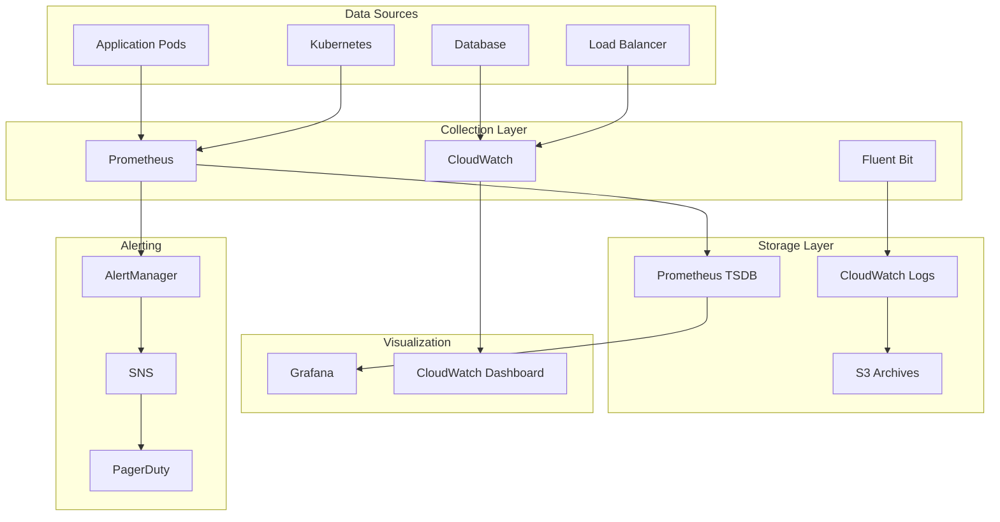

# Monitoring and Alerting Guide

This comprehensive guide covers the complete monitoring, alerting, and observability setup for the MedinovAI Chatbot system, ensuring HIPAA compliance and operational excellence.

## Table of Contents

1. [Overview](#overview)
2. [Architecture](#monitoring-architecture)
3. [Metrics Collection](#metrics-collection)
4. [Logging Strategy](#logging-strategy)
5. [Alerting Configuration](#alerting-configuration)
6. [Dashboards](#dashboards)
7. [Compliance Monitoring](#compliance-monitoring)
8. [Troubleshooting](#troubleshooting)

---

## Overview

### Monitoring Objectives

- **Availability**: 99.95% uptime SLA monitoring
- **Performance**: Response time < 2 seconds for 95% of requests
- **Security**: Real-time threat detection and compliance monitoring
- **Business Metrics**: Conversation success rates, user satisfaction
- **Resource Utilization**: Optimize costs and capacity planning

### Key Performance Indicators (KPIs)

| Metric | Target | Alert Threshold |
|--------|--------|----------------|
| API Response Time | < 2s (95th percentile) | > 5s |
| Error Rate | < 0.1% | > 1% |
| Database Response Time | < 100ms | > 500ms |
| Memory Usage | < 80% | > 90% |
| CPU Usage | < 70% | > 85% |
| Conversation Success Rate | > 85% | < 80% |

---

## Monitoring Architecture

### Component Overview



### Infrastructure Components

#### 1. **Prometheus Stack**
```yaml
# Prometheus configuration
global:
  scrape_interval: 15s
  evaluation_interval: 15s
  retention: 30d

rule_files:
  - "medinovai-rules.yml"
  - "kubernetes-rules.yml"

scrape_configs:
  - job_name: 'medinovai-backend'
    kubernetes_sd_configs:
    - role: endpoints
      namespaces:
        names:
        - medinovai
    relabel_configs:
    - source_labels: [__meta_kubernetes_service_name]
      action: keep
      regex: medinovai-backend-service
```

#### 2. **Grafana Configuration**
```yaml
# Grafana datasources
datasources:
  - name: Prometheus
    type: prometheus
    url: http://prometheus:9090
    access: proxy
    isDefault: true
  
  - name: CloudWatch
    type: cloudwatch
    jsonData:
      defaultRegion: us-east-1
      authType: default
```

---

## Metrics Collection

### 1. **Application Metrics**

#### Custom Metrics Implementation

```python
# src/utils/metrics.py
from prometheus_client import Counter, Histogram, Gauge, generate_latest
from datetime import datetime
import time

# Request metrics
REQUEST_COUNT = Counter(
    'http_requests_total',
    'Total HTTP requests',
    ['method', 'endpoint', 'status']
)

REQUEST_DURATION = Histogram(
    'http_request_duration_seconds',
    'HTTP request duration',
    ['method', 'endpoint']
)

# Business metrics
CONVERSATION_COUNT = Counter(
    'conversations_total',
    'Total conversations started',
    ['channel', 'language']
)

CONVERSATION_SUCCESS = Counter(
    'conversations_success_total',
    'Successful conversations',
    ['channel', 'resolution_type']
)

AI_RESPONSE_TIME = Histogram(
    'ai_response_time_seconds',
    'AI response generation time',
    ['model', 'complexity']
)

# System metrics
ACTIVE_CONNECTIONS = Gauge(
    'active_connections',
    'Number of active database connections'
)

CACHE_HIT_RATE = Gauge(
    'cache_hit_rate',
    'Redis cache hit rate percentage'
)

# Security metrics
AUTHENTICATION_ATTEMPTS = Counter(
    'authentication_attempts_total',
    'Authentication attempts',
    ['method', 'status']
)

SMS_DELIVERY = Counter(
    'sms_delivery_total',
    'SMS delivery attempts',
    ['status', 'provider']
)
```

#### Metrics Middleware

```python
# src/middleware/metrics.py
from fastapi import Request
import time

async def metrics_middleware(request: Request, call_next):
    start_time = time.time()
    
    response = await call_next(request)
    
    # Record metrics
    duration = time.time() - start_time
    REQUEST_COUNT.labels(
        method=request.method,
        endpoint=request.url.path,
        status=response.status_code
    ).inc()
    
    REQUEST_DURATION.labels(
        method=request.method,
        endpoint=request.url.path
    ).observe(duration)
    
    return response
```

### 2. **Infrastructure Metrics**

#### Kubernetes Metrics
```yaml
# ServiceMonitor for application
apiVersion: monitoring.coreos.com/v1
kind: ServiceMonitor
metadata:
  name: medinovai-metrics
  namespace: monitoring
  labels:
    app: medinovai
spec:
  selector:
    matchLabels:
      app: medinovai-backend
  endpoints:
  - port: metrics
    interval: 30s
    path: /metrics
    honorLabels: true
```

#### Database Metrics
```yaml
# PostgreSQL Exporter
apiVersion: apps/v1
kind: Deployment
metadata:
  name: postgres-exporter
  namespace: medinovai
spec:
  replicas: 1
  selector:
    matchLabels:
      app: postgres-exporter
  template:
    metadata:
      labels:
        app: postgres-exporter
    spec:
      containers:
      - name: postgres-exporter
        image: prometheuscommunity/postgres-exporter:latest
        env:
        - name: DATA_SOURCE_NAME
          valueFrom:
            secretKeyRef:
              name: postgres-exporter-secret
              key: DATA_SOURCE_NAME
        ports:
        - containerPort: 9187
          name: metrics
```

### 3. **Business Metrics**

#### Conversation Analytics
```python
# src/analytics/conversation_metrics.py
from datetime import datetime, timedelta
from sqlalchemy import func
from src.models import Conversation, Message

class ConversationAnalytics:
    def __init__(self, db):
        self.db = db
    
    def get_success_rate(self, hours=24):
        """Calculate conversation success rate"""
        cutoff_time = datetime.utcnow() - timedelta(hours=hours)
        
        total_conversations = self.db.query(Conversation).filter(
            Conversation.created_at >= cutoff_time
        ).count()
        
        successful_conversations = self.db.query(Conversation).filter(
            Conversation.created_at >= cutoff_time,
            Conversation.status == 'resolved',
            Conversation.satisfaction_rating >= 4
        ).count()
        
        return (successful_conversations / total_conversations * 100) if total_conversations > 0 else 0
    
    def get_average_response_time(self, hours=24):
        """Calculate average AI response time"""
        cutoff_time = datetime.utcnow() - timedelta(hours=hours)
        
        avg_time = self.db.query(func.avg(Message.response_time)).filter(
            Message.created_at >= cutoff_time,
            Message.sender == 'ai'
        ).scalar()
        
        return avg_time or 0
    
    def get_escalation_rate(self, hours=24):
        """Calculate human escalation rate"""
        cutoff_time = datetime.utcnow() - timedelta(hours=hours)
        
        total_conversations = self.db.query(Conversation).filter(
            Conversation.created_at >= cutoff_time
        ).count()
        
        escalated_conversations = self.db.query(Conversation).filter(
            Conversation.created_at >= cutoff_time,
            Conversation.escalated == True
        ).count()
        
        return (escalated_conversations / total_conversations * 100) if total_conversations > 0 else 0
```

---

## Logging Strategy

### 1. **Log Levels and Categories**

#### Application Logging Configuration
```python
# src/utils/logging_config.py
import logging
import json
from datetime import datetime
import re

# PHI Detection Patterns
PHI_PATTERNS = [
    r'\b\d{3}-\d{2}-\d{4}\b',  # SSN
    r'\b\d{4}\s?\d{4}\s?\d{4}\s?\d{4}\b',  # Credit Card
    r'\b[A-Za-z0-9._%+-]+@[A-Za-z0-9.-]+\.[A-Z|a-z]{2,}\b',  # Email
    r'\b\d{3}-\d{3}-\d{4}\b',  # Phone
]

class PHIRedactingFilter(logging.Filter):
    def filter(self, record):
        if hasattr(record, 'msg'):
            for pattern in PHI_PATTERNS:
                record.msg = re.sub(pattern, '[REDACTED]', str(record.msg))
        return True

class StructuredFormatter(logging.Formatter):
    def format(self, record):
        log_entry = {
            'timestamp': datetime.utcnow().isoformat(),
            'level': record.levelname,
            'logger': record.name,
            'message': record.getMessage(),
            'module': record.module,
            'function': record.funcName,
            'line': record.lineno
        }
        
        # Add correlation ID if available
        if hasattr(record, 'correlation_id'):
            log_entry['correlation_id'] = record.correlation_id
        
        # Add user context if available
        if hasattr(record, 'user_id'):
            log_entry['user_id'] = record.user_id
        
        # Add request context if available
        if hasattr(record, 'request_id'):
            log_entry['request_id'] = record.request_id
        
        return json.dumps(log_entry)

# Configure root logger
def setup_logging():
    logger = logging.getLogger()
    logger.setLevel(logging.INFO)
    
    # Create handler
    handler = logging.StreamHandler()
    handler.setFormatter(StructuredFormatter())
    handler.addFilter(PHIRedactingFilter())
    
    logger.addHandler(handler)
    
    # Configure specific loggers
    logging.getLogger('uvicorn.access').setLevel(logging.INFO)
    logging.getLogger('sqlalchemy.engine').setLevel(logging.WARNING)
    logging.getLogger('src.security').setLevel(logging.DEBUG)
```

### 2. **Log Aggregation**

#### Fluent Bit Configuration
```yaml
apiVersion: v1
kind: ConfigMap
metadata:
  name: fluent-bit-config
  namespace: kube-system
data:
  fluent-bit.conf: |
    [SERVICE]
        Flush         5
        Log_Level     info
        Daemon        off
        Parsers_File  parsers.conf
        HTTP_Server   On
        HTTP_Listen   0.0.0.0
        HTTP_Port     2020

    [INPUT]
        Name              tail
        Path              /var/log/containers/medinovai-*.log
        multiline.parser  docker, cri
        Tag               medinovai.*
        Refresh_Interval  5

    [FILTER]
        Name                kubernetes
        Match               medinovai.*
        Kube_URL            https://kubernetes.default.svc:443
        Kube_CA_File        /var/run/secrets/kubernetes.io/serviceaccount/ca.crt
        Kube_Token_File     /var/run/secrets/kubernetes.io/serviceaccount/token
        Merge_Log           On
        K8S-Logging.Parser  On
        K8S-Logging.Exclude Off

    [FILTER]
        Name    grep
        Match   medinovai.*
        Regex   log level=(ERROR|WARN|INFO|DEBUG)

    [OUTPUT]
        Name                cloudwatch_logs
        Match               medinovai.*
        region              us-east-1
        log_group_name      /medinovai/application
        log_stream_prefix   pod-
        auto_create_group   true
        retry_limit         2

    [OUTPUT]
        Name                s3
        Match               medinovai.*
        bucket              medinovai-audit-logs
        region              us-east-1
        total_file_size     1M
        upload_timeout      10m
        use_put_object      On
        s3_key_format       /year=%Y/month=%m/day=%d/hour=%H/medinovai-%Y%m%d%H%M%S
```

### 3. **Audit Logging**

#### Security Event Logging
```python
# src/utils/audit_logger.py
import logging
from datetime import datetime
from enum import Enum

class AuditEventType(Enum):
    LOGIN_SUCCESS = "LOGIN_SUCCESS"
    LOGIN_FAILURE = "LOGIN_FAILURE"
    DATA_ACCESS = "DATA_ACCESS"
    DATA_MODIFICATION = "DATA_MODIFICATION"
    PERMISSION_CHANGE = "PERMISSION_CHANGE"
    SYSTEM_CONFIGURATION = "SYSTEM_CONFIGURATION"
    EXPORT_DATA = "EXPORT_DATA"
    ESCALATION = "ESCALATION"

class AuditLogger:
    def __init__(self):
        self.logger = logging.getLogger('audit')
        
    def log_event(self, event_type: AuditEventType, user_id: str = None, 
                  details: dict = None, request_ip: str = None):
        """Log security audit event"""
        audit_entry = {
            'event_type': event_type.value,
            'timestamp': datetime.utcnow().isoformat(),
            'user_id': user_id,
            'ip_address': request_ip,
            'details': details or {},
            'compliance_required': True
        }
        
        self.logger.info(f"AUDIT: {audit_entry}")
    
    def log_data_access(self, user_id: str, resource: str, action: str, 
                       request_ip: str = None):
        """Log data access for HIPAA compliance"""
        self.log_event(
            AuditEventType.DATA_ACCESS,
            user_id=user_id,
            details={
                'resource': resource,
                'action': action,
                'phi_involved': True
            },
            request_ip=request_ip
        )

# Usage in API endpoints
audit_logger = AuditLogger()

@app.post("/api/conversations")
async def create_conversation(request: Request, user: User = Depends(get_current_user)):
    audit_logger.log_data_access(
        user_id=user.id,
        resource="conversation",
        action="create",
        request_ip=request.client.host
    )
```

---

## Alerting Configuration

### 1. **Alert Rules**

#### Critical Alerts
```yaml
# prometheus-rules.yml
groups:
- name: medinovai.critical
  rules:
  - alert: MedinovAIServiceDown
    expr: up{job="medinovai-backend"} == 0
    for: 1m
    labels:
      severity: critical
      team: platform
    annotations:
      summary: "MedinovAI service is down"
      description: "MedinovAI backend service has been down for more than 1 minute"
      runbook: "https://docs.medinovai.com/troubleshooting/service-down"

  - alert: HighErrorRate
    expr: rate(http_requests_total{status=~"5.."}[5m]) > 0.05
    for: 2m
    labels:
      severity: critical
      team: platform
    annotations:
      summary: "High error rate detected"
      description: "Error rate is {{ $value | humanizePercentage }} (threshold: 5%)"
      
  - alert: DatabaseConnectionFailure
    expr: postgresql_up == 0
    for: 30s
    labels:
      severity: critical
      team: platform
    annotations:
      summary: "Database connection failure"
      description: "PostgreSQL database is not accessible"

  - alert: MemoryUsageHigh
    expr: (container_memory_usage_bytes{pod=~"medinovai-.*"} / container_spec_memory_limit_bytes) > 0.9
    for: 2m
    labels:
      severity: warning
      team: platform
    annotations:
      summary: "High memory usage"
      description: "Memory usage is {{ $value | humanizePercentage }} for pod {{ $labels.pod }}"
```

#### Security Alerts
```yaml
- name: medinovai.security
  rules:
  - alert: MultipleFailedLogins
    expr: increase(authentication_attempts_total{status="failed"}[5m]) > 10
    for: 1m
    labels:
      severity: warning
      team: security
    annotations:
      summary: "Multiple failed login attempts"
      description: "{{ $value }} failed login attempts in the last 5 minutes"

  - alert: UnauthorizedAPIAccess
    expr: rate(http_requests_total{status="401"}[5m]) > 0.1
    for: 2m
    labels:
      severity: warning
      team: security
    annotations:
      summary: "High rate of unauthorized API access"
      description: "Unauthorized access rate is {{ $value }} requests/second"

  - alert: AbnormalDataAccess
    expr: rate(data_access_total[15m]) > rate(data_access_total[1h] offset 1h) * 2
    for: 5m
    labels:
      severity: warning
      team: security
    annotations:
      summary: "Abnormal data access pattern detected"
      description: "Data access rate is significantly higher than normal"
```

#### Business Alerts
```yaml
- name: medinovai.business
  rules:
  - alert: LowConversationSuccessRate
    expr: conversation_success_rate < 80
    for: 10m
    labels:
      severity: warning
      team: product
    annotations:
      summary: "Low conversation success rate"
      description: "Conversation success rate is {{ $value }}% (threshold: 80%)"

  - alert: HighEscalationRate
    expr: escalation_rate > 20
    for: 15m
    labels:
      severity: warning
      team: product
    annotations:
      summary: "High escalation rate"
      description: "Escalation rate is {{ $value }}% (threshold: 20%)"

  - alert: SlowAIResponse
    expr: histogram_quantile(0.95, ai_response_time_seconds) > 5
    for: 5m
    labels:
      severity: warning
      team: ai
    annotations:
      summary: "Slow AI response times"
      description: "95th percentile AI response time is {{ $value }}s (threshold: 5s)"
```

### 2. **AlertManager Configuration**

#### Routing and Notification
```yaml
# alertmanager.yml
global:
  smtp_smarthost: 'smtp.sendgrid.net:587'
  smtp_from: 'alerts@medinovai.com'
  smtp_auth_username: 'apikey'
  smtp_auth_password: 'SG.your-sendgrid-api-key'

templates:
- '/etc/alertmanager/templates/*.tmpl'

route:
  group_by: ['alertname', 'severity']
  group_wait: 10s
  group_interval: 5m
  repeat_interval: 1h
  receiver: 'default'
  routes:
  - match:
      severity: critical
    receiver: 'critical-alerts'
    group_wait: 5s
    repeat_interval: 5m
  - match:
      team: security
    receiver: 'security-team'
  - match:
      team: platform
    receiver: 'platform-team'
  - match:
      team: product
    receiver: 'product-team'

receivers:
- name: 'default'
  email_configs:
  - to: 'alerts@medinovai.com'
    subject: '{{ .GroupLabels.alertname }} - {{ .Status | toUpper }}'
    body: '{{ template "email.default.html" . }}'

- name: 'critical-alerts'
  email_configs:
  - to: 'oncall@medinovai.com'
    subject: 'CRITICAL: {{ .GroupLabels.alertname }}'
    body: '{{ template "email.critical.html" . }}'
  slack_configs:
  - api_url: 'https://hooks.slack.com/services/YOUR/SLACK/WEBHOOK'
    channel: '#critical-alerts'
    title: 'Critical Alert: {{ .GroupLabels.alertname }}'
    text: '{{ range .Alerts }}{{ .Annotations.description }}{{ end }}'
  pagerduty_configs:
  - routing_key: 'your-pagerduty-integration-key'
    description: '{{ .GroupLabels.alertname }}'

- name: 'security-team'
  email_configs:
  - to: 'security@medinovai.com'
    subject: 'Security Alert: {{ .GroupLabels.alertname }}'
    body: '{{ template "email.security.html" . }}'

- name: 'platform-team'
  email_configs:
  - to: 'platform@medinovai.com'
    subject: 'Platform Alert: {{ .GroupLabels.alertname }}'
    body: '{{ template "email.platform.html" . }}'

- name: 'product-team'
  email_configs:
  - to: 'product@medinovai.com'
    subject: 'Product Alert: {{ .GroupLabels.alertname }}'
    body: '{{ template "email.product.html" . }}'

inhibit_rules:
- source_match:
    severity: 'critical'
  target_match:
    severity: 'warning'
  equal: ['alertname', 'instance']
```

### 3. **Alert Templates**

#### Email Templates
```html
<!-- email.critical.html -->
{{ define "email.critical.html" }}
<!DOCTYPE html>
<html>
<head>
    <style>
        body { font-family: Arial, sans-serif; }
        .critical { background-color: #ff4444; color: white; padding: 10px; }
        .details { background-color: #f5f5f5; padding: 10px; margin: 10px 0; }
    </style>
</head>
<body>
    <div class="critical">
        <h2>🚨 CRITICAL ALERT 🚨</h2>
        <p>Service: MedinovAI Chatbot</p>
        <p>Time: {{ .Alerts.First.StartsAt.Format "2006-01-02 15:04:05 UTC" }}</p>
    </div>
    
    {{ range .Alerts }}
    <div class="details">
        <h3>{{ .Annotations.summary }}</h3>
        <p><strong>Description:</strong> {{ .Annotations.description }}</p>
        <p><strong>Severity:</strong> {{ .Labels.severity }}</p>
        <p><strong>Team:</strong> {{ .Labels.team }}</p>
        {{ if .Annotations.runbook }}
        <p><strong>Runbook:</strong> <a href="{{ .Annotations.runbook }}">{{ .Annotations.runbook }}</a></p>
        {{ end }}
    </div>
    {{ end }}
    
    <p><a href="https://grafana.medinovai.com">View Dashboards</a> | <a href="https://alerts.medinovai.com">Manage Alerts</a></p>
</body>
</html>
{{ end }}
```

---

## Dashboards

### 1. **Executive Dashboard**

#### Key Metrics Overview
```json
{
  "dashboard": {
    "title": "MedinovAI - Executive Overview",
    "panels": [
      {
        "title": "System Health Score",
        "type": "stat",
        "targets": [
          {
            "expr": "avg(up{job=\"medinovai-backend\"}) * 100",
            "legendFormat": "Uptime %"
          }
        ],
        "fieldConfig": {
          "defaults": {
            "min": 0,
            "max": 100,
            "unit": "percent",
            "thresholds": {
              "steps": [
                {"color": "red", "value": 0},
                {"color": "yellow", "value": 95},
                {"color": "green", "value": 99}
              ]
            }
          }
        }
      },
      {
        "title": "Daily Active Conversations",
        "type": "graph",
        "targets": [
          {
            "expr": "increase(conversations_total[24h])",
            "legendFormat": "Total Conversations"
          },
          {
            "expr": "increase(conversations_success_total[24h])",
            "legendFormat": "Successful Conversations"
          }
        ]
      },
      {
        "title": "Response Time Trends",
        "type": "graph",
        "targets": [
          {
            "expr": "histogram_quantile(0.95, rate(http_request_duration_seconds_bucket[5m]))",
            "legendFormat": "95th Percentile"
          },
          {
            "expr": "histogram_quantile(0.50, rate(http_request_duration_seconds_bucket[5m]))",
            "legendFormat": "50th Percentile"
          }
        ]
      },
      {
        "title": "Cost per Conversation",
        "type": "stat",
        "targets": [
          {
            "expr": "(aws_billing_estimated_charges / increase(conversations_total[24h]))",
            "legendFormat": "Cost/Conversation"
          }
        ]
      }
    ]
  }
}
```

### 2. **Operations Dashboard**

#### Technical Metrics
```json
{
  "dashboard": {
    "title": "MedinovAI - Operations",
    "panels": [
      {
        "title": "Pod Status",
        "type": "table",
        "targets": [
          {
            "expr": "kube_pod_info{namespace=\"medinovai\"}",
            "format": "table"
          }
        ]
      },
      {
        "title": "Resource Usage",
        "type": "graph",
        "targets": [
          {
            "expr": "rate(container_cpu_usage_seconds_total{pod=~\"medinovai-.*\"}[5m]) * 100",
            "legendFormat": "CPU %"
          },
          {
            "expr": "(container_memory_usage_bytes{pod=~\"medinovai-.*\"} / container_spec_memory_limit_bytes) * 100",
            "legendFormat": "Memory %"
          }
        ]
      },
      {
        "title": "Database Performance",
        "type": "graph",
        "targets": [
          {
            "expr": "postgresql_stat_database_tup_fetched",
            "legendFormat": "Rows Fetched"
          },
          {
            "expr": "postgresql_stat_database_tup_inserted",
            "legendFormat": "Rows Inserted"
          }
        ]
      },
      {
        "title": "Error Rates by Endpoint",
        "type": "heatmap",
        "targets": [
          {
            "expr": "rate(http_requests_total{status=~\"5..\"}[5m]) by (endpoint)",
            "legendFormat": "{{endpoint}}"
          }
        ]
      }
    ]
  }
}
```

### 3. **Security Dashboard**

#### Security Monitoring
```json
{
  "dashboard": {
    "title": "MedinovAI - Security",
    "panels": [
      {
        "title": "Authentication Events",
        "type": "graph",
        "targets": [
          {
            "expr": "rate(authentication_attempts_total{status=\"success\"}[5m])",
            "legendFormat": "Successful Logins"
          },
          {
            "expr": "rate(authentication_attempts_total{status=\"failed\"}[5m])",
            "legendFormat": "Failed Logins"
          }
        ]
      },
      {
        "title": "WAF Blocked Requests",
        "type": "stat",
        "targets": [
          {
            "expr": "sum(rate(aws_waf_blocked_requests[5m]))",
            "legendFormat": "Blocked/min"
          }
        ]
      },
      {
        "title": "SSL Certificate Expiry",
        "type": "table",
        "targets": [
          {
            "expr": "ssl_certificate_expiry_days",
            "format": "table"
          }
        ]
      },
      {
        "title": "Audit Log Volume",
        "type": "graph",
        "targets": [
          {
            "expr": "rate(audit_events_total[5m]) by (event_type)",
            "legendFormat": "{{event_type}}"
          }
        ]
      }
    ]
  }
}
```

### 4. **Business Dashboard**

#### Product Metrics
```json
{
  "dashboard": {
    "title": "MedinovAI - Business Metrics",
    "panels": [
      {
        "title": "Conversation Success Rate",
        "type": "stat",
        "targets": [
          {
            "expr": "(sum(conversations_success_total) / sum(conversations_total)) * 100",
            "legendFormat": "Success Rate %"
          }
        ],
        "fieldConfig": {
          "defaults": {
            "thresholds": {
              "steps": [
                {"color": "red", "value": 0},
                {"color": "yellow", "value": 80},
                {"color": "green", "value": 90}
              ]
            }
          }
        }
      },
      {
        "title": "Channel Distribution",
        "type": "piechart",
        "targets": [
          {
            "expr": "sum by (channel) (conversations_total)",
            "legendFormat": "{{channel}}"
          }
        ]
      },
      {
        "title": "User Satisfaction Trends",
        "type": "graph",
        "targets": [
          {
            "expr": "avg_over_time(conversation_satisfaction_rating[1h])",
            "legendFormat": "Average Rating"
          }
        ]
      },
      {
        "title": "Escalation Reasons",
        "type": "table",
        "targets": [
          {
            "expr": "sum by (reason) (escalation_total)",
            "format": "table"
          }
        ]
      }
    ]
  }
}
```

---

## Compliance Monitoring

### 1. **HIPAA Compliance Metrics**

#### Audit Requirements
```python
# src/compliance/hipaa_monitor.py
from datetime import datetime, timedelta
from sqlalchemy import func
from src.models import AuditLog, DataAccess, User

class HIPAAComplianceMonitor:
    def __init__(self, db):
        self.db = db
    
    def check_audit_log_integrity(self):
        """Verify audit logs are complete and tamper-free"""
        # Check for gaps in audit logs
        yesterday = datetime.utcnow() - timedelta(days=1)
        
        log_count = self.db.query(AuditLog).filter(
            AuditLog.timestamp >= yesterday
        ).count()
        
        # Should have logs at least every hour
        expected_minimum = 24  # Minimum 1 log per hour
        
        return {
            'log_count': log_count,
            'compliance': log_count >= expected_minimum,
            'missing_hours': max(0, expected_minimum - log_count)
        }
    
    def check_access_controls(self):
        """Verify access controls are working"""
        failed_accesses = self.db.query(DataAccess).filter(
            DataAccess.access_granted == False,
            DataAccess.timestamp >= datetime.utcnow() - timedelta(hours=24)
        ).count()
        
        total_accesses = self.db.query(DataAccess).filter(
            DataAccess.timestamp >= datetime.utcnow() - timedelta(hours=24)
        ).count()
        
        denial_rate = (failed_accesses / total_accesses * 100) if total_accesses > 0 else 0
        
        return {
            'total_accesses': total_accesses,
            'denied_accesses': failed_accesses,
            'denial_rate': denial_rate,
            'compliance': 0 < denial_rate < 10  # Some denials expected, but not too many
        }
    
    def check_encryption_status(self):
        """Verify data encryption is active"""
        # This would integrate with your encryption monitoring
        return {
            'database_encrypted': True,  # Check from DB config
            'transit_encrypted': True,   # Check from TLS config
            'backup_encrypted': True,    # Check from backup config
            'compliance': True
        }
    
    def generate_compliance_report(self):
        """Generate daily compliance report"""
        audit_status = self.check_audit_log_integrity()
        access_status = self.check_access_controls()
        encryption_status = self.check_encryption_status()
        
        overall_compliance = (
            audit_status['compliance'] and
            access_status['compliance'] and
            encryption_status['compliance']
        )
        
        report = {
            'timestamp': datetime.utcnow().isoformat(),
            'overall_compliance': overall_compliance,
            'audit_logging': audit_status,
            'access_controls': access_status,
            'encryption': encryption_status
        }
        
        # Store report
        self.store_compliance_report(report)
        
        return report
```

### 2. **Compliance Alerts**

#### HIPAA Violation Detection
```yaml
# compliance-rules.yml
groups:
- name: hipaa.compliance
  rules:
  - alert: AuditLogGap
    expr: increase(audit_events_total[1h]) == 0
    for: 1h
    labels:
      severity: critical
      compliance: hipaa
    annotations:
      summary: "Audit logging gap detected"
      description: "No audit events logged in the past hour - potential compliance violation"

  - alert: UnencryptedDataAccess
    expr: data_access_unencrypted_total > 0
    for: 0s
    labels:
      severity: critical
      compliance: hipaa
    annotations:
      summary: "Unencrypted data access detected"
      description: "{{ $value }} unencrypted data access attempts detected"

  - alert: ExcessiveDataExport
    expr: increase(data_export_total[1h]) > 100
    for: 5m
    labels:
      severity: warning
      compliance: hipaa
    annotations:
      summary: "Excessive data export activity"
      description: "{{ $value }} data exports in the past hour exceeds normal threshold"

  - alert: FailedAccessAttempts
    expr: rate(data_access_denied_total[5m]) > 0.1
    for: 10m
    labels:
      severity: warning
      compliance: hipaa
    annotations:
      summary: "High rate of access denials"
      description: "Access denial rate is {{ $value }} per second"
```

### 3. **Compliance Reporting**

#### Automated Compliance Reports
```python
# src/compliance/reporting.py
from datetime import datetime, timedelta
import pandas as pd
from src.utils.database import get_db
from src.models import AuditLog, DataAccess, User

class ComplianceReporter:
    def __init__(self):
        self.db = next(get_db())
    
    def generate_monthly_hipaa_report(self, month=None, year=None):
        """Generate monthly HIPAA compliance report"""
        if not month:
            month = datetime.now().month
        if not year:
            year = datetime.now().year
        
        start_date = datetime(year, month, 1)
        end_date = datetime(year, month + 1, 1) if month < 12 else datetime(year + 1, 1, 1)
        
        # Audit log analysis
        audit_events = self.db.query(AuditLog).filter(
            AuditLog.timestamp >= start_date,
            AuditLog.timestamp < end_date
        ).all()
        
        # Data access analysis
        data_accesses = self.db.query(DataAccess).filter(
            DataAccess.timestamp >= start_date,
            DataAccess.timestamp < end_date
        ).all()
        
        report = {
            'report_period': f"{year}-{month:02d}",
            'generated_at': datetime.utcnow().isoformat(),
            'summary': {
                'total_audit_events': len(audit_events),
                'total_data_accesses': len(data_accesses),
                'access_violations': len([a for a in data_accesses if not a.access_granted]),
                'days_with_audit_gaps': self._count_audit_gaps(audit_events, start_date, end_date)
            },
            'details': {
                'top_accessed_resources': self._get_top_accessed_resources(data_accesses),
                'access_patterns': self._analyze_access_patterns(data_accesses),
                'security_incidents': self._get_security_incidents(audit_events),
                'user_activity': self._analyze_user_activity(data_accesses)
            },
            'compliance_status': {
                'audit_logging_complete': len(audit_events) > 0,
                'access_controls_functional': self._verify_access_controls(data_accesses),
                'encryption_maintained': True,  # Check from config
                'breach_incidents': 0  # Check from incident reports
            }
        }
        
        # Generate PDF report
        self._generate_pdf_report(report)
        
        return report
    
    def _count_audit_gaps(self, events, start_date, end_date):
        """Count days with no audit events"""
        event_dates = set(event.timestamp.date() for event in events)
        total_days = (end_date - start_date).days
        days_with_events = len(event_dates)
        return total_days - days_with_events
    
    def _get_top_accessed_resources(self, accesses):
        """Get most frequently accessed resources"""
        resource_counts = {}
        for access in accesses:
            resource = access.resource_type
            resource_counts[resource] = resource_counts.get(resource, 0) + 1
        
        return sorted(resource_counts.items(), key=lambda x: x[1], reverse=True)[:10]
```

---

## Troubleshooting

### 1. **Common Issues**

#### Metrics Not Collecting
```bash
# Check if metrics endpoint is accessible
kubectl exec -it deployment/medinovai-backend -n medinovai -- curl http://localhost:9090/metrics

# Verify ServiceMonitor
kubectl get servicemonitor -n monitoring
kubectl describe servicemonitor medinovai-metrics -n monitoring

# Check Prometheus targets
kubectl port-forward svc/prometheus-kube-prometheus-prometheus 9090:9090 -n monitoring
# Then visit http://localhost:9090/targets
```

#### Alerts Not Firing
```bash
# Check Prometheus rules
kubectl get prometheusrule -n monitoring
kubectl describe prometheusrule medinovai-alerts -n monitoring

# Check AlertManager
kubectl logs alertmanager-prometheus-kube-prometheus-alertmanager-0 -n monitoring

# Test alert rule
promtool query instant 'up{job="medinovai-backend"} == 0'
```

#### Grafana Dashboard Issues
```bash
# Check Grafana logs
kubectl logs deployment/prometheus-grafana -n monitoring

# Verify datasource connectivity
kubectl exec -it deployment/prometheus-grafana -n monitoring -- curl http://prometheus:9090/api/v1/query?query=up

# Reset admin password
kubectl get secret prometheus-grafana -n monitoring -o jsonpath="{.data.admin-password}" | base64 --decode
```

### 2. **Performance Optimization**

#### Prometheus Storage
```yaml
# Optimize Prometheus storage
prometheus:
  prometheusSpec:
    retention: 30d
    storageSpec:
      volumeClaimTemplate:
        spec:
          storageClassName: gp3
          resources:
            requests:
              storage: 100Gi
    # Optimize for better performance
    resources:
      requests:
        memory: 2Gi
        cpu: 1000m
      limits:
        memory: 4Gi
        cpu: 2000m
```

#### Query Optimization
```yaml
# Recording rules for expensive queries
groups:
- name: medinovai.recording
  interval: 30s
  rules:
  - record: medinovai:conversation_success_rate
    expr: |
      (
        sum(rate(conversations_success_total[5m])) /
        sum(rate(conversations_total[5m]))
      ) * 100
  
  - record: medinovai:avg_response_time
    expr: |
      histogram_quantile(0.95, 
        sum(rate(http_request_duration_seconds_bucket[5m])) by (le)
      )
```

---

## Best Practices

### 1. **Metric Design**
- Use consistent naming conventions (prometheus_metric_name_unit)
- Include relevant labels for filtering and grouping
- Avoid high-cardinality labels
- Use histograms for latency measurements
- Use counters for event counting

### 2. **Alert Design**
- Set appropriate thresholds based on historical data
- Use multi-window alerting for reduced noise
- Include runbook links in alert annotations
- Test alerts regularly
- Group related alerts to reduce spam

### 3. **Dashboard Design**
- Create role-specific dashboards
- Use consistent time ranges
- Include drill-down capabilities
- Display SLIs prominently
- Use annotations for deployments and incidents

### 4. **Compliance**
- Automate compliance checks
- Store audit logs for required retention periods
- Regular compliance report generation
- Monitor access patterns for anomalies
- Maintain audit trail integrity

---

This monitoring guide provides comprehensive coverage of observability for the MedinovAI system. Regular review and updates ensure continued effectiveness as the system evolves. 