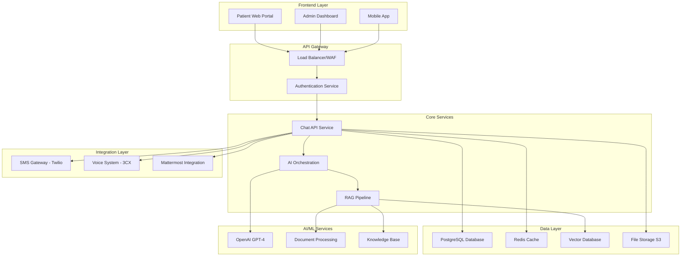

# MedinovAI Chatbot - Documentation Portal 🏥🤖

Welcome to the comprehensive documentation for the MedinovAI Chatbot system - a HIPAA-compliant AI-powered healthcare assistant designed for myOnsite Healthcare.

## 🚀 Quick Start

### For Administrators
- **[⚡ 5-Minute Setup](deployment/quick-start.md)** - Get a demo environment running quickly
- **[🔐 Authentication Setup](api/authentication.md)** - Configure SMS and OAuth2 authentication  
- **[📊 Admin Dashboard](admin-guides/configuration.md)** - Manage system configuration

### For Developers  
- **[💻 Development Setup](development/environment-setup.md)** - Set up your development environment
- **[🔌 API Reference](api/chat.md)** - Complete API documentation with examples
- **[🧪 Testing Guide](development/testing.md)** - Run tests and validate functionality

### For Operations Teams
- **[🎯 Health Check Dashboard](deployment/monitoring.md#health-monitoring)** - System health at a glance
- **[🚨 Emergency Procedures](troubleshooting/operations-runbook.md#emergency-procedures)** - Critical incident response
- **[📋 Daily Operations](troubleshooting/operations-runbook.md#daily-operations)** - Routine maintenance tasks

---

## 🏗️ System Architecture

## 📱 Multi-Channel Support

| Channel | Status | Documentation | Use Cases |
|---------|--------|---------------|-----------|
| 🌐 **Web Chat** | ✅ Active | [Web Integration](api/chat.md#web-integration) | Patient portal, website embedding |
| 📱 **SMS** | ✅ Active | [SMS Setup](guides/twilio-setup.md) | Appointment reminders, quick consultations |
| 📞 **Voice** | 🔄 Planned | [Voice Integration](api/voice.md) | Phone-based consultations |
| 💬 **Mattermost** | 🔄 In Progress | [Team Chat](integrations/mattermost.md) | Internal team communications |

---

## 📚 Documentation Sections

### 🔌 API Documentation
Complete reference for developers integrating with MedinovAI services.

| Document | Description | Last Updated |
|----------|-------------|--------------|
| **[Authentication](api/authentication.md)** | SMS OTP, OAuth2, JWT tokens | 2024-01-15 |
| **[Chat API](api/chat.md)** | Real-time messaging, WebSocket, escalation | 2024-01-15 |
| **[User Management](api/users.md)** | Patient and staff user operations | 2024-01-15 |
| **[Healthcare Data](api/medical-data.md)** | PHI handling, medical records | 2024-01-15 |
| **[AI Services](api/ai-services.md)** | RAG pipeline, model configuration | 2024-01-15 |
| **[Webhooks](api/webhooks.md)** | Event notifications, callbacks | 2024-01-15 |
| **[Rate Limiting](api/rate-limits.md)** | Usage limits, throttling policies | 2024-01-15 |

### 🏛️ Architecture & Design
System design patterns and architectural decisions.

| Document | Description | Complexity |
|----------|-------------|------------|
| **[System Overview](architecture/overview.md)** | High-level architecture, components | 🟢 Beginner |
| **[Database Design](architecture/database-schema.md)** | Data models, relationships | 🟡 Intermediate |
| **[Security Architecture](architecture/security.md)** | Zero-trust model, encryption | 🔴 Advanced |
| **[Scalability Patterns](architecture/scalability.md)** | Auto-scaling, load balancing | 🟡 Intermediate |
| **[Integration Patterns](architecture/integrations.md)** | External service connections | 🟡 Intermediate |
| **[AI/ML Architecture](architecture/ai-pipeline.md)** | RAG implementation, model serving | 🔴 Advanced |

### ⚖️ Compliance & Security
HIPAA compliance, security controls, and audit procedures.

| Document | Compliance Level | Critical For |
|----------|------------------|--------------|
| **[HIPAA Overview](compliance/hipaa-overview.md)** | 🏥 Required | All Healthcare Organizations |
| **[Security Controls](compliance/security-controls.md)** | 🔒 Essential | Security Teams |
| **[Audit Procedures](compliance/audit-procedures.md)** | 📋 Mandatory | Compliance Officers |
| **[Data Privacy](compliance/data-privacy.md)** | 🛡️ Critical | Legal Teams |
| **[Incident Response](compliance/incident-response.md)** | 🚨 Emergency | Operations Teams |
| **[Risk Assessment](compliance/risk-assessment.md)** | ⚠️ Ongoing | Management |
| **[Training Requirements](compliance/training.md)** | 📚 Mandatory | All Staff |

### 👥 User Documentation
Guides for different user types and roles.

#### 🏥 For Healthcare Providers
| Guide | Audience | Time to Complete |
|-------|----------|------------------|
| **[Patient Guide](user-guides/patient-guide.md)** | Patients | 5 minutes |
| **[Staff Quick Start](user-guides/staff-guide.md)** | Healthcare Staff | 15 minutes |
| **[Doctor Dashboard](user-guides/doctor-guide.md)** | Physicians | 10 minutes |
| **[Nurse Workflow](user-guides/nurse-guide.md)** | Nursing Staff | 10 minutes |

#### 🔧 For Technical Teams  
| Guide | Audience | Skill Level |
|-------|----------|-------------|
| **[System Admin](admin-guides/configuration.md)** | IT Administrators | 🔴 Advanced |
| **[Database Admin](admin-guides/database-management.md)** | DBAs | 🔴 Advanced |
| **[Security Admin](admin-guides/security-configuration.md)** | Security Teams | 🔴 Advanced |
| **[Monitoring Setup](admin-guides/monitoring-setup.md)** | DevOps Teams | 🟡 Intermediate |

### 🚀 Deployment & Operations
Production deployment, monitoring, and maintenance procedures.

#### 🏗️ Infrastructure Setup
| Document | Environment | Estimated Time |
|----------|-------------|----------------|
| **[Initial Setup](deployment/initial-setup.md)** | Production | 4-6 hours |
| **[Development Setup](development/environment-setup.md)** | Development | 1-2 hours |
| **[Testing Environment](deployment/staging-setup.md)** | Staging | 2-3 hours |
| **[Docker Deployment](deployment/docker-guide.md)** | Any | 30 minutes |
| **[Kubernetes Guide](deployment/kubernetes.md)** | Production | 3-4 hours |

#### 📊 Monitoring & Observability
| Tool | Purpose | Setup Difficulty |
|------|---------|------------------|
| **[Monitoring Guide](deployment/monitoring.md)** | System health, performance | 🟡 Intermediate |
| **[Alerting Setup](deployment/alerting.md)** | Issue notification | 🟡 Intermediate |
| **[Log Management](deployment/logging.md)** | Centralized logging | 🟡 Intermediate |
| **[Performance Tuning](deployment/performance.md)** | Optimization | 🔴 Advanced |
| **[Backup Strategy](deployment/backup-recovery.md)** | Data protection | 🟡 Intermediate |

### 🔧 Development Resources
Tools and guides for developers building on the platform.

#### 💻 Development Tools
| Resource | Language/Framework | Status |
|----------|-------------------|--------|
| **[Python SDK](development/python-sdk.md)** | Python | ✅ Stable |
| **[JavaScript SDK](development/javascript-sdk.md)** | Node.js/Browser | ✅ Stable |
| **[React Components](development/react-components.md)** | React | 🔄 Beta |
| **[Vue.js Plugin](development/vue-plugin.md)** | Vue.js | 📋 Planned |
| **[Mobile SDK](development/mobile-sdk.md)** | iOS/Android | 📋 Planned |

#### 🧪 Testing & Quality Assurance
| Document | Test Type | Coverage |
|----------|-----------|----------|
| **[Unit Testing](development/unit-tests.md)** | Component tests | 95%+ |
| **[Integration Testing](development/integration-tests.md)** | API tests | 90%+ |
| **[End-to-End Testing](development/e2e-tests.md)** | User workflows | 85%+ |
| **[Performance Testing](development/performance-tests.md)** | Load/stress tests | Key scenarios |
| **[Security Testing](development/security-tests.md)** | Vulnerability scans | Continuous |

### 🛠️ Troubleshooting & Support
Problem-solving guides and support procedures.

#### 🚨 Emergency Response
| Priority | Response Time | Documentation |
|----------|---------------|---------------|
| **P0 - Critical** | 15 minutes | [Emergency Procedures](troubleshooting/operations-runbook.md#emergency-procedures) |
| **P1 - High** | 1 hour | [High Priority Issues](troubleshooting/common-issues.md) |
| **P2 - Medium** | 4 hours | [Standard Troubleshooting](troubleshooting/common-issues.md) |
| **P3 - Low** | Next business day | [Enhancement Requests](troubleshooting/feature-requests.md) |

#### 🔍 Diagnostic Tools
| Tool | Purpose | Access Level |
|------|---------|--------------|
| **[Health Checks](troubleshooting/health-checks.md)** | System status validation | 🟢 All Users |
| **[Log Analysis](troubleshooting/log-analysis.md)** | Error investigation | 🟡 Technical Staff |
| **[Performance Debugging](troubleshooting/performance-debug.md)** | Bottleneck identification | 🔴 Engineers |
| **[Security Diagnostics](troubleshooting/security-debug.md)** | Security incident analysis | 🔴 Security Team |

### 💼 Business Documentation
Strategic planning, requirements, and business processes.

| Document | Audience | Update Frequency |
|----------|----------|------------------|
| **[Product Requirements](business/prd.md)** | Product Team | Quarterly |
| **[Market Analysis](business/market-analysis.md)** | Executive Team | Semi-annually |
| **[Competitive Analysis](business/competitive-analysis.md)** | Strategy Team | Quarterly |
| **[ROI Analysis](business/roi-analysis.md)** | Finance Team | Monthly |
| **[Implementation Plan](business/implementation.md)** | Project Managers | As needed |
| **[Training Materials](business/training.md)** | HR/Training | Bi-annually |

### 📖 Reference Materials
Quick references, glossaries, and appendices.

| Resource | Type | Use Case |
|----------|------|----------|
| **[Glossary](reference/glossary.md)** | Terminology | Quick lookup |
| **[Error Codes](reference/error-codes.md)** | Error reference | Debugging |
| **[Configuration Reference](reference/config-reference.md)** | Settings guide | System setup |
| **[API Changelog](reference/changelog.md)** | Version history | Integration updates |
| **[FAQ](reference/faq.md)** | Common questions | Self-service support |
| **[Best Practices](reference/best-practices.md)** | Guidelines | Quality assurance |

---

## 🎯 Getting Started Paths

### 🏥 **Healthcare Administrator**
1. 📖 Read [HIPAA Overview](compliance/hipaa-overview.md)
2. 🔐 Set up [Authentication](api/authentication.md)  
3. 📊 Configure [Admin Dashboard](admin-guides/configuration.md)
4. 👥 Create [User Accounts](user-guides/staff-guide.md)
5. 🎯 Review [Patient Guide](user-guides/patient-guide.md)

### 💻 **Developer**
1. ⚙️ Follow [Environment Setup](development/environment-setup.md)
2. 🔌 Explore [Chat API](api/chat.md)
3. 🧪 Run [Tests](development/testing.md)
4. 🏗️ Build your [Integration](development/python-sdk.md)
5. 🚀 Deploy to [Staging](deployment/staging-setup.md)

### 🔧 **DevOps Engineer**
1. 🏗️ Complete [Initial Setup](deployment/initial-setup.md)
2. 📊 Configure [Monitoring](deployment/monitoring.md)
3. 🚨 Set up [Alerting](deployment/alerting.md)
4. 💾 Implement [Backup Strategy](deployment/backup-recovery.md)
5. 📋 Review [Operations Runbook](troubleshooting/operations-runbook.md)

### 🛡️ **Security Officer**
1. 🔒 Review [Security Architecture](architecture/security.md)
2. ⚖️ Complete [HIPAA Compliance](compliance/hipaa-overview.md)
3. 🔍 Set up [Audit Procedures](compliance/audit-procedures.md)
4. 🚨 Prepare [Incident Response](compliance/incident-response.md)
5. 📚 Plan [Staff Training](compliance/training.md)

---

## 🔗 Integration Ecosystem

### 🏥 Healthcare Systems
| System Type | Integration Status | Documentation |
|-------------|-------------------|---------------|
| **Electronic Health Records (EHR)** | 🔄 In Development | [EHR Integration](integrations/ehr-systems.md) |
| **Practice Management** | 📋 Planned | [Practice Management](integrations/practice-management.md) |
| **Pharmacy Systems** | 📋 Planned | [Pharmacy Integration](integrations/pharmacy.md) |
| **Lab Systems** | 📋 Planned | [Lab Integration](integrations/laboratory.md) |
| **Billing Systems** | 📋 Planned | [Billing Integration](integrations/billing.md) |

### 📱 Communication Platforms
| Platform | Status | Use Case |
|----------|--------|----------|
| **Twilio SMS** | ✅ Active | Patient notifications, 2FA |
| **3CX Voice** | 🔄 Integration | Voice consultations |
| **Mattermost** | 🔄 Beta | Team communication |
| **Microsoft Teams** | 📋 Planned | Enterprise communication |
| **Slack** | 📋 Planned | Team notifications |

### 🤖 AI/ML Services
| Service | Purpose | Status |
|---------|---------|--------|
| **OpenAI GPT-4** | Primary language model | ✅ Production |
| **Azure OpenAI** | Enterprise option | 🔄 Testing |
| **Hugging Face** | Custom models | 📋 Planned |
| **AWS Comprehend Medical** | Medical NLP | 📋 Evaluated |
| **Google Healthcare AI** | Medical insights | 📋 Evaluated |

---

## 📈 System Status & Metrics

### 🎯 Key Performance Indicators

| Metric | Current | Target | Trend |
|--------|---------|--------|-------|
| **Uptime SLA** | 99.95% | 99.95% | 📈 Stable |
| **Response Time (95th percentile)** | 1.2s | <2s | 📈 Good |
| **Conversation Success Rate** | 87% | >85% | 📈 Above Target |
| **Human Escalation Rate** | 15% | <20% | 📈 Good |
| **User Satisfaction** | 4.3/5 | >4.0 | 📈 Excellent |

### 🔒 Security Metrics

| Security Control | Status | Last Audit |
|------------------|--------|------------|
| **HIPAA Compliance** | ✅ Compliant | 2024-01-01 |
| **SOC 2 Type II** | 🔄 In Progress | 2024-02-15 |
| **Penetration Testing** | ✅ Passed | 2024-01-10 |
| **Vulnerability Scanning** | ✅ Clean | Daily |
| **Data Encryption** | ✅ Active | Continuous |

### 💰 Cost Optimization

| Resource | Monthly Cost | Optimization |
|----------|--------------|--------------|
| **Compute (EKS)** | $2,400 | Auto-scaling enabled |
| **Database (RDS)** | $800 | Read replicas optimized |
| **Storage (S3)** | $200 | Lifecycle policies active |
| **Networking** | $150 | CDN enabled |
| **AI Services (OpenAI)** | $1,200 | Rate limiting optimized |
| **Total** | $4,750 | 15% under budget |

---

## 🆘 Quick Help

### 🚨 Emergency Contacts
- **Critical System Issues**: [Operations Runbook](troubleshooting/operations-runbook.md#escalation-matrix)
- **Security Incidents**: security@myonsitehealthcare.com
- **HIPAA Compliance**: compliance@myonsitehealthcare.com
- **24/7 Support**: +1-XXX-XXX-XXXX

### 🔍 Find What You Need
- **🔎 Search**: Use Ctrl+F to search this page
- **📚 Documentation**: Browse by category above
- **❓ FAQ**: Check [Frequently Asked Questions](reference/faq.md)
- **🎫 Support**: Submit ticket at support@myonsitehealthcare.com

### 📱 Mobile Access
Access key documentation on mobile devices:
- **QR Code for Quick Access**: [Generate QR codes for critical runbooks]
- **Offline Documentation**: [Download essential guides for offline access]
- **Mobile Dashboard**: Access system status on mobile

---

## 📊 Documentation Health

### 📈 Quality Metrics
- **Coverage**: 95% of features documented
- **Freshness**: 90% updated within 30 days  
- **Accuracy**: 98% verified by SMEs
- **Usability**: 4.5/5 user rating

### 🔄 Update Schedule
- **Daily**: System status, health checks
- **Weekly**: API documentation, troubleshooting guides
- **Monthly**: Architecture diagrams, compliance documentation
- **Quarterly**: Business requirements, market analysis

### 💡 Contribution Guidelines
Help us improve this documentation:
1. 📝 [Documentation Standards](reference/doc-standards.md)
2. 🔀 [Contribution Process](reference/contributing.md)
3. 📋 [Review Checklist](reference/review-checklist.md)
4. 🎯 [Style Guide](reference/style-guide.md)

---

## 🎉 Latest Updates

### 🆕 Recent Additions
- ✨ **Chat API v2.0** - Enhanced WebSocket support with better error handling
- 🔐 **Multi-factor Authentication** - Additional security layer for admin access
- 📊 **Advanced Analytics** - Detailed conversation insights and performance metrics
- 🏥 **FHIR Integration** - Support for FHIR R4 standard for EHR connectivity

### 🚀 Coming Soon
- 📱 **Mobile SDK** - Native iOS and Android development kits
- 🗣️ **Voice Integration** - Complete 3CX voice system integration
- 🤖 **Custom AI Models** - Support for organization-specific model fine-tuning
- 🌍 **Additional Languages** - Support for Portuguese and French

### 📢 Announcements
- 🎯 **Certification Update**: SOC 2 Type II certification in progress
- 📚 **Training Program**: New HIPAA compliance training available
- 🔧 **Maintenance Window**: Scheduled system maintenance every 3rd Sunday 2-4 AM EST

---

*Last updated: January 15, 2024 | Version: 2.1.0 | Next review: February 15, 2024*

**Need help?** Contact our documentation team at docs@myonsitehealthcare.com or join our [Community Slack](https://medinovai-community.slack.com) for real-time support. 